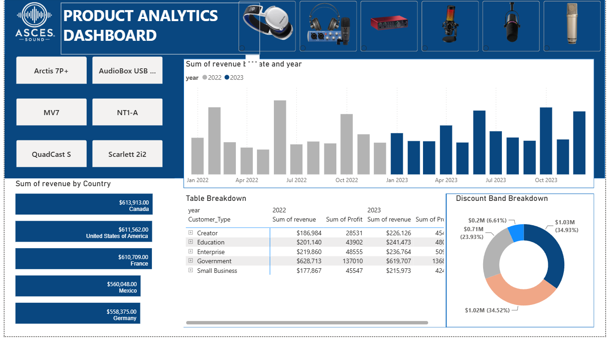

# Asces Sound: Global Product Analytics Dashboard

## 📌 Project Overview
This project delivers a high-level **Product Analytics Dashboard** for **Asces Sound**, a leading innovator in the audio technology industry specializing in premium audio interfaces, microphones, and production accessories. Designed as a strategic 1-page executive summary, this dashboard transforms global sales logs into actionable insights—tracking revenue across countries, evaluating Year-over-Year (YoY) growth, and analyzing the impact of discount strategies to support data-driven decision-making for leadership.

---

## 🛠️ Tech Stack & Tools
* **Database & Data Extraction:** MySQL (Structured queries for data preparation)
* **Data Visualization & Modelling:** Power BI
* **Analytical Calculations:** DAX (Data Analysis Expressions) for Time-Intelligence / YoY metrics.
---

## 💡 Business Case Analysis (STAR Framework)

### 1. Situation (The Context)
**Asces Sound** distributes state-of-the-art audio equipment to musicians, content creators, and engineers worldwide. As the business scales globally, management and stakeholders required a consolidated, high-level overview of product performance. They lacked an automated, unified system to monitor seasonal trends, comparative country performance, and the financial trade-offs of their retail discount frameworks.

### 2. Task (The Goal)
My task was to design and develop a single-page **Product Analytics Dashboard** that addresses management's core requirements, calculates critical Year-over-Year growth, and introduces advanced product-level breakdown metrics to assist executive leadership in strategic forecasting.

### 3. Action (Our Approach)
* **Step 1: SQL Data Extraction** – Wrote optimized SQL queries to aggregate raw global sales logs, filter inconsistencies, and prepare clean tables segmented by country and discount bands.
* **Step 2: Data Modelling** – Imported the refined datasets into Power BI and established a star-schema model with a dedicated Date/Calendar table for time-series tracking.
* **Step 3: DAX Engineering** – Developed advanced DAX measures to calculate dynamic metrics, specifically **YoY Profit Change %** and **YoY Unit Sales Change %**.
* **Step 4: UI/UX Visual Design** – Designed a clean, executive-focused 1-page layout ensuring a high-impact, scannable data hierarchy for stakeholders.
---

## 📊 Dashboard Breakdown & Management Requirements

#### 📊 1. Revenue by Country & Detailed Table View
* **Visual Used:** Map / Horizontal Bar Chart and a Matrix Table.
* **Insight:** Identifies top-performing global regions and provides granular, drill-down access to exact revenue and profit figures by country and year.

#### 📈 2. Revenue Trends by Date and Year
* **Visual Used:** Clustered Column & Line Combo Chart.
* **Insight:** Displays comparative chronological trends, allowing management to immediately spot peak sales seasons and historical growth patterns.

#### 🔢 3. Profit and Unit Sales Year-over-Year (YoY) Change
* **Visual Used:** Advanced KPI Cards with Conditional Formatting.
* **Insight:** Delivers a high-level executive summary of business health, showing exactly whether profit and volume are growing or shrinking compared to the previous year.

#### 🏷️ 4. Revenue Breakdown by Discount Band
* **Visual Used:** Donut Chart / Treemap.
* **Insight:** Illustrates the distribution of revenue across different discount categories (None, Low, Medium, High). Helps management audit if aggressive discounting is diluting brand value or genuinely driving volume.

#### 🚀 5. Value-Add Features (What I Added Extra for Management)
* **Product Performance Leaderboard:** A Bar Chart isolating the top-selling flagship audio products (e.g., specific audio interfaces or microphones) to optimize inventory.
* **Gross Profit Margin (%) Slicer:** Integrated a high-level margin indicator to help management identify which product-country mix yields the highest actual profitability, not just raw revenue.

---

## 🚀 Strategic Recommendations for Asces Sound

1. **Targeted Regional Expansion:** Allocate higher marketing budgets to the top-3 performing countries identified in the dashboard, specifically tailoring campaigns toward content creators and remote audio engineers.
2. **Optimize Discount Guardrails:** Review the "High" discount bands. If data reveals that high discounts do not yield a proportional spike in YoY unit sales, recommend shifting toward "Low-to-Medium" seasonal bundles to protect profit margins.
3. **Inventory Alignment with YoY Trends:** Utilize the chronological revenue trends to pre-schedule manufacturing runs for flagship audio interfaces 1–2 months ahead of identified peak quarters.

---

## 📸 Dashboard Preview & Interaction
> 💡 *Below is the visual showcase of the interactive Product Analytics Dashboard built for Asces Sound.*

